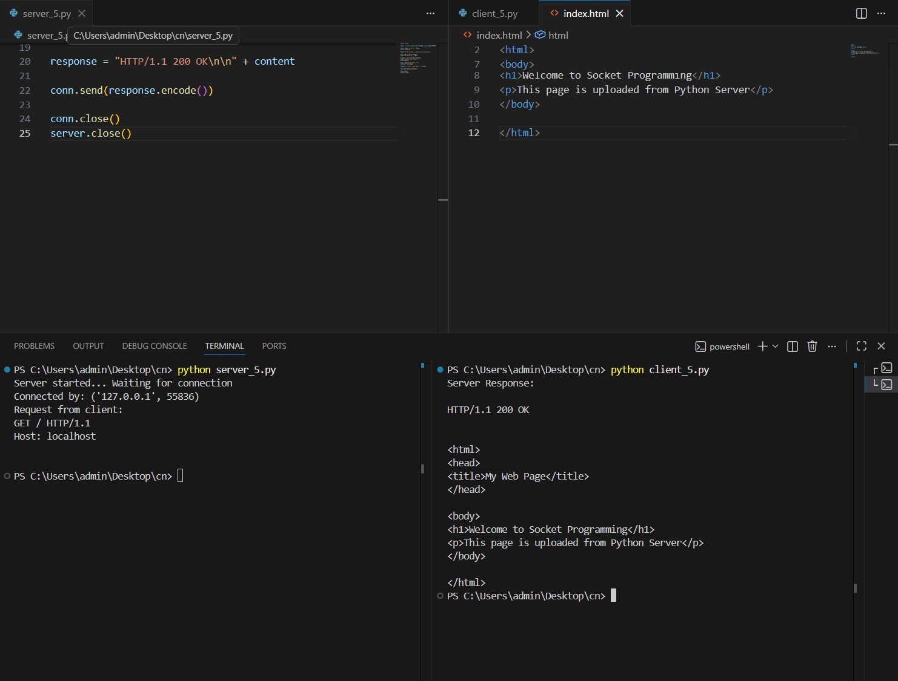

# 5a_Create_Socket_for_HTTP_for_webpage_upload_and_download
## NAME: PRAGATHI KUMAR
## REGISTER NUMBER : 212224230200
## AIM :
To write a PYTHON program for socket for HTTP for web page upload and download
## Algorithm

1.Start the program.
<BR>
2.Get the frame size from the user
<BR>
3.To create the frame based on the user request.
<BR>
4.To send frames to server from the client side.
<BR>
5.If your frames reach the server it will send ACK signal to client otherwise it will send NACK signal to client.
<BR>
6.Stop the program
<BR>
## Program

CLIENT.py

```
import socket

client = socket.socket(socket.AF_INET, socket.SOCK_STREAM)

client.connect(("127.0.0.1", 8080))

request = "GET / HTTP/1.1\r\nHost: localhost\r\n\r\n"

client.send(request.encode())

data = client.recv(4096)

print("Server Response:\n")
print(data.decode())

client.close()
```

SERVER.py

```
import socket

server = socket.socket(socket.AF_INET, socket.SOCK_STREAM)

server.bind(("127.0.0.1", 8080))
server.listen(1)

print("Server started... Waiting for connection")

conn, addr = server.accept()
print("Connected by:", addr)

request = conn.recv(1024).decode()
print("Request from client:")
print(request)

file = open("index.html", "r")
content = file.read()

response = "HTTP/1.1 200 OK\n\n" + content

conn.send(response.encode())

conn.close()
server.close()

```

index.html

```
<html>
<head>
<title>My Web Page</title>
</head>

<body>
<h1>Welcome to Socket Programming</h1>
<p>This page is uploaded from Python Server</p>
</body>

</html>
```
## OUTPUT


## Result
Thus the socket for HTTP for web page upload and download created and Executed
